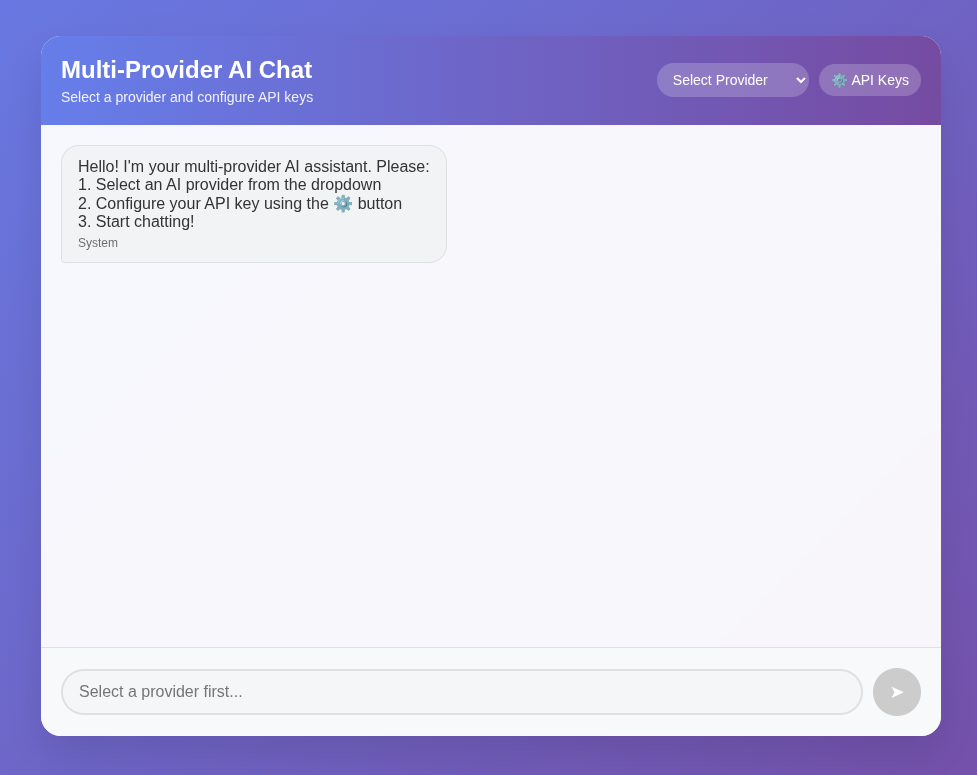
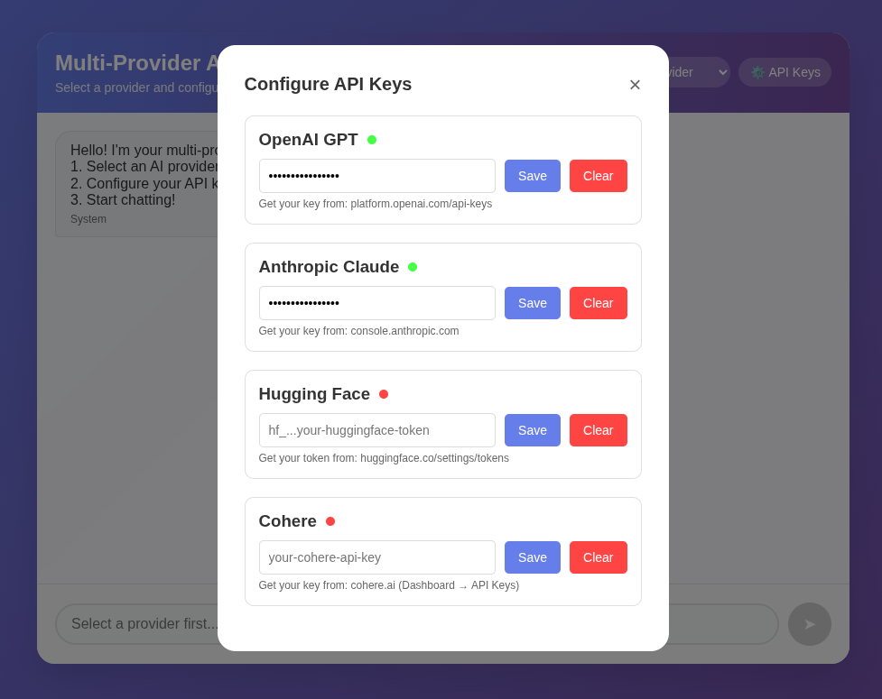

# Multi-Provider-AI-Chat

A practice project on how to use different Model's API

# Demonstration

<p align="center">
  
  
</p>

## Prerequisites

- **Python 3.8+**: Ensure Python is installed.
- **Web Browser**: Any modern browser (e.g., Chrome, Firefox).
- **API Key/s**: Obtain from designated platform.

## Project Structure

```
/
├── backend/
│   ├── main.py
│   └── requirements.txt
├── frontend/
│   └── index.html
```

## 🛠️ Setup Instructions

### 1. Set Up the Backend

1. **Navigate to the Backend Directory**:

   ```bash
   cd backend/
   ```

2. **Create a Virtual Environment**:

   ```bash
   python3 -m venv venv
   source venv/bin/activate  # On Windows: venv\Scripts\activate
   ```

3. **Install Dependencies**:

   ```bash
   pip install -r requirements.txt
   ```

4. **Run the Backend Server**:

   ```bash
   uvicorn main:app --reload
   ```

   - The server will run on `http://localhost:8000`.

### 2. Set Up the Frontend

1. **Navigate to the Frontend Directory**:

   ```bash
   cd frontend/
   ```

2. **Serve the Frontend**:
   - Option 1: Open `index.html` directly in a web browser (e.g., double-click the file).
   - Option 2: Serve it using a local server for better reliability:

     ```bash
     python3 -m http.server 8080
     ```

     - Access the app at `http://localhost:8080` in your browser.

### Thanks for reading! Now try it out
